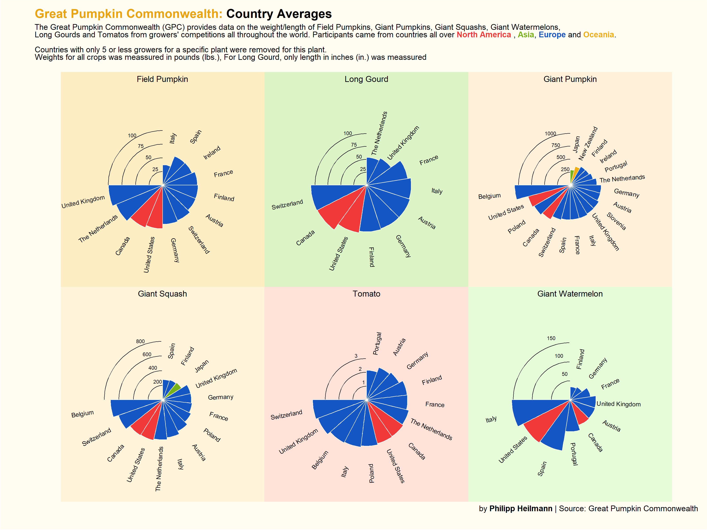

# \#TidyTuesday

This repository contains all my contributions to the #TidyTuesday. Tidytuesday is a community activity where a new dataset is provided every week so that every participant can explore it and create a creative visualization of some aspect of the data. More information and all datasets can be found in the official [Github repository](https://github.com/rfordatascience/tidytuesday/)

***

### 2021-10-19
**Ultra Trail Running**

This dataset contains data of thousands of runners participating in ultra trail races. These are races longer than a marathon. I was interested in the especially long races (>100 km) and how long it takes different runners to finish them. I rempved all races that had an uncommon distance and I removed all runners that did not finish a race.

### 2021-10-19
**Giant Pumpkins**

The Great Pumpkin Commonwealth (GPC) provides data on weight and length of different crops presented at various growers' competitions all over the world as well as their ranking within the year compared to other crops of the same variety. Data is available for six different crops thoughout the years 2013 to 2021.

### 2021-10-05
**Nurses in the US**

Data from data.world that contains detailed information on the employment situation of registered nurses in the US. Data contains information on wage/salary distribution, location quotients (industry concentration) and number of employed nurses of all US states from 1998 to 2020.

### 2021-09-28
**NBER Papers**

Contains information about papers published by the National Bureau of Economic Research between 1973 and 2021. I have seen a lot of barplot races on the internet and for this one, I tried creating one myself for the first time. It shows the number of publications an author has contributed to over the last decades.

